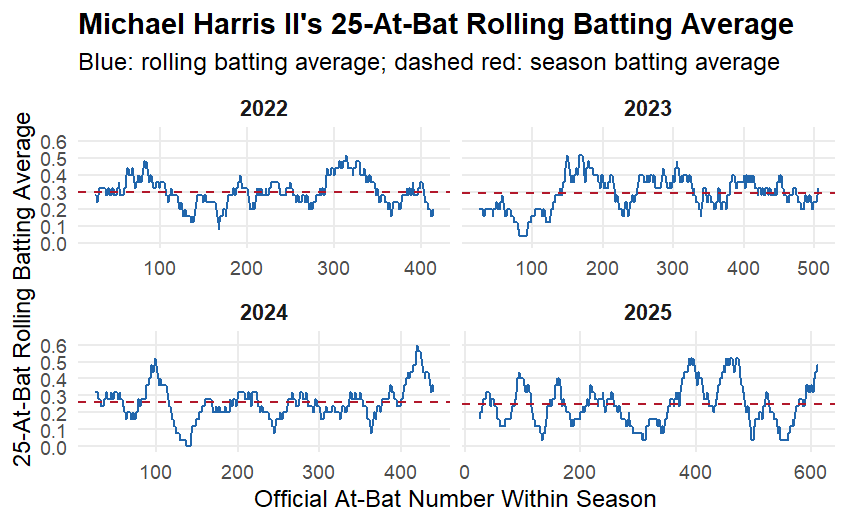
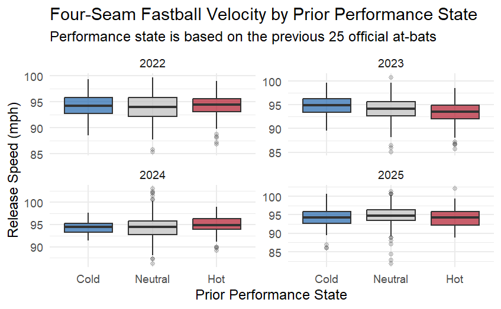
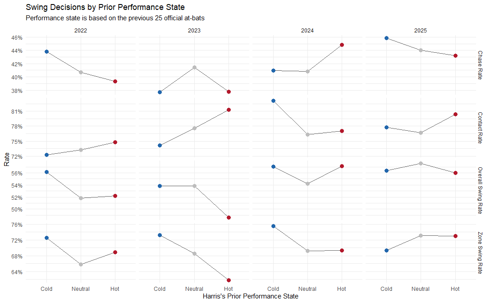
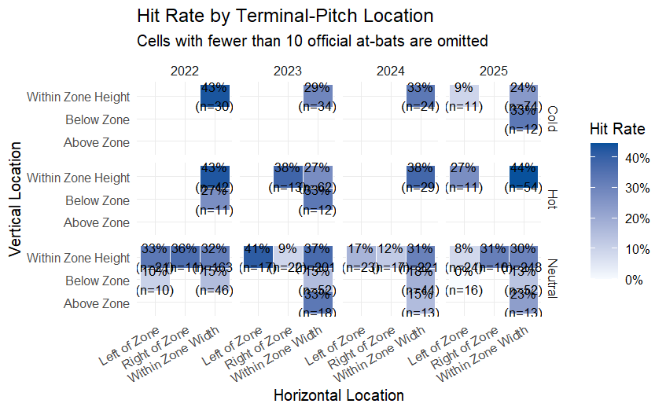
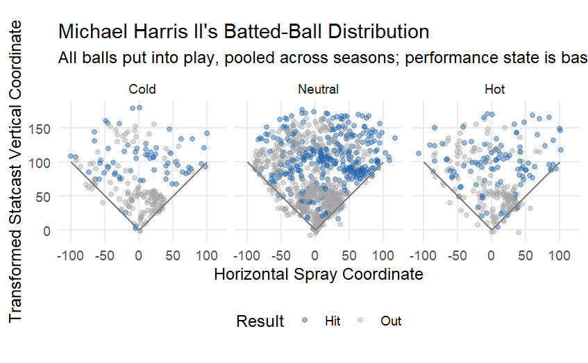
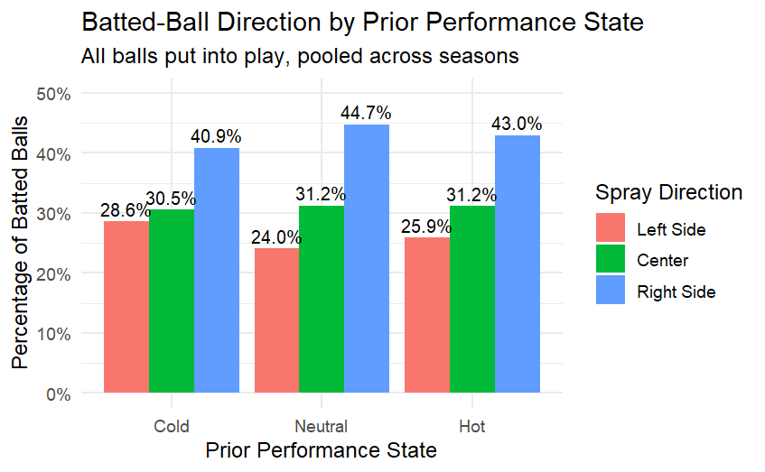

```{r setup, include=FALSE}
knitr::opts_chunk$set(
  echo = FALSE,
  warning = FALSE,
  message = FALSE,
  fig.width = 9,
  fig.height = 6,
  fig.align = "center"
)
```

# Introduction

Performance streaks are common in sports narratives. When a player records several successful outcomes within a short period, observers may describe the player as “hot” and expect the elevated performance to continue. However, visible clusters of hits and outs do not by themselves establish a hot-hand effect. Even when successive outcomes are independent, random sequences can naturally contain apparent streaks.

This project examines the short-term batting performance of Michael Harris II during the 2022–2025 Major League Baseball seasons. Rather than identifying hot streaks solely from a graph, the analysis asks whether Harris’s observed rolling-performance variation was greater than would be expected under a clearly defined random model.

The primary research question is:

> Did Michael Harris II’s short-term batting performance exhibit more streakiness than would be expected from independent hitting outcomes with the same season-level batting average?

To answer this question, pitch-level MLB Statcast records were converted into chronologically ordered official at-bats. A 25-at-bat rolling batting average was calculated separately within each season. Each observed season was then compared with 5,000 simulated seasons generated under an independent Bernoulli null model with the same number of official at-bats and the same season batting average.

The project also considers a secondary question:

> If a season appeared unusually streaky, were the observed performance states associated with changes in pitcher behavior or Harris’s own batting behavior?

The mechanism analysis therefore examines pitch velocity, pitch mix, pitch location, swing decisions, terminal-pitch location, and batted-ball direction across prior Hot, Neutral, and Cold performance states. These comparisons are treated as exploratory rather than causal.

The analysis distinguishes between three possible interpretations: ordinary random variation, changes in how pitchers approached Harris, and changes in Harris’s own decisions or batted-ball outcomes. This structure allows the project to evaluate the statistical evidence for streakiness before attempting to explain its possible mechanisms.


# Data and Variable Construction

## Data Source

The analysis uses MLB Statcast data for Michael Harris II from the
2022 through 2025 regular seasons. The original dataset is organized at the pitch level, meaning that each row represents one pitch rather than one plate appearance or official at-bat.

The available variables include game identifiers, game date, at-bat and pitch numbers, pitch characteristics, pitch location, plate-appearance outcomes, and batted-ball coordinates. Variable definitions are documented in the accompanying Statcast data codebook.

## Unit of Analysis

Different research questions require different units of analysis. The
original pitch-level observations were therefore transformed into several related datasets.

For chronological ordering, pitches were arranged by game date, game
identifier, at-bat number, and pitch number. The final pitch of each plate appearance was then retained to identify the plate-appearance outcome.

Plate appearances that did not count as official at-bats—such as walks, hit-by-pitches, sacrifice events, and catcher interference—were excluded from the batting-average analysis. The resulting official-at-bat dataset contains one chronologically ordered observation per official at-bat.

Pitch-level records were retained separately for the pitcher-behavior and swing-decision analyses. Batted-ball analyses were restricted to terminal pitches on which the ball was put into play and valid Statcast hit coordinates were available.

| Analysis | Unit of analysis |
|----|---|
| Rolling batting average | Official at-bat |
| Monte Carlo simulation | Official at-bat |
| Pitch velocity and pitch mix  | Individual pitch |
| Swing decisions | Individual pitch |
| Terminal-pitch location | Official at-bat |
| Spray direction | Ball put into play |

## Research Variables

The primary binary outcome variable, `hit`, equals 1 when an official
at-bat resulted in a single, double, triple, or home run and equals 0 for all other official-at-bat outcomes.

Within each season, `season_ab_number` records the chronological position of every official at-bat. The variable resets to 1 at the beginning of each new season.

The main short-term performance measure is `rolling_ba_25`, defined as the mean of the hit indicator over the most recent 25 official at-bats, including the current at-bat. Because a complete window is required, the first 24 official at-bats in each season have missing rolling values.

For the exploratory mechanism analyses, each rolling batting average was standardized within its season. Prior performance was classified as Hot when the standardized rolling average was at least one standard deviation above the season mean, Cold when it was at least one standard deviation below the mean, and Neutral otherwise.

The performance state assigned to a current plate appearance was based on the previous 25 official at-bats. This lagged definition prevents the current outcome from being used to classify its own prior performance state.

| Variable | Definition |
|---|---|
| `game_year` | MLB season corresponding to the game date |
| `official_at_bat` | Indicator that the plate appearance counts as an official at-bat |
| `hit` | 1 for single, double, triple, or home run; 0 otherwise |
| `season_ab_number` | Chronological official-at-bat number within a season |
| `rolling_ba_25` | Batting average over the most recent 25 official at-bats |
| `prior_performance_state` | Lagged Hot, Neutral, or Cold classification based on prior rolling performance |

# Rolling Batting Average

A 25-official-at-bat window was selected to balance short-term responsiveness and statistical stability. A very small window would be highly sensitive to one or two outcomes, causing the rolling average to change sharply because of ordinary game-to-game noise. In contrast, a much larger window would smooth over the short-term variation that the analysis is intended to examine.

For a regular player, 25 official at-bats approximately represent several games to about one week of batting opportunities, although the exact duration depends on playing time and the number of plate appearances per game. The window therefore provides an interpretable measure of recent performance without reducing the analysis to isolated games.

The 25-at-bat window is treated as a fixed analytical choice and is applied consistently across all observed and simulated seasons. It should not be interpreted as the uniquely correct definition of a hot period. Results may depend on the selected window length, so comparisons with alternative windows could be considered as a sensitivity analysis.


## Rolling-Window Definition

Batting outcomes are recorded as a binary sequence in which a hit equals 1
and a non-hit official at-bat equals 0. To summarize short-term
performance, the analysis uses a 25-official-at-bat rolling batting
average.

For official at-bat t, the rolling batting average is defined as:

$$
RollingBA_t =
\frac{1}{25}
\sum_{j=t-24}^{t} Hit_j
$$

Each rolling window contains the current official at-bat and the preceding 24 official at-bats. After each new official at-bat, the window advances by one observation: the oldest outcome leaves the window and the newest outcome enters it. Therefore, this is a genuinely rolling measure rather than a division of the season into non-overlapping groups of 25.

The rolling calculation is performed separately within each season, so a window never combines at-bats from two different seasons. The first 24 official at-bats of each season are assigned missing values because a complete 25-at-bat window is not yet available.

A 25-at-bat window was selected as a balance between responsiveness and stability. A much smaller window would react strongly to one or two outcomes, while a much larger window could smooth over meaningful
short-term variation. The same window definition is used for both the
observed and simulated data.

## Observed Seasonal Patterns

```{r season-summary-table, echo=FALSE}
season_report_table <- data.frame(
  Season = c(2022, 2023, 2024, 2025),
  `Official at-bats` = c(414, 505, 440, 611),
  Hits = c(123, 148, 116, 152),
  `Season batting average` = c(".297", ".293", ".264", ".249"),
  check.names = FALSE
)

knitr::kable(
  season_report_table,
  align = c("c", "c", "c", "c"),
  caption = "Michael Harris II's Season-Level Batting Summary"
)
```

Harris's season batting average declined from approximately .297 in 2022 to .249 in 2025. However, the season-level batting average does not describe how hits and non-hits were distributed through time. Two seasons can have the same overall batting average while exhibiting very different short-term patterns.

The 25-at-bat rolling series reveals substantial within-season
fluctuation. Some windows contain relatively high concentrations of hits, while others contain few or no hits. The magnitude of these fluctuations appears especially large in the later seasons.

Nevertheless, a visually irregular rolling series is not sufficient
evidence of a hot-hand effect. Random binary sequences can naturally
produce clusters of successes and failures, and adjacent rolling averages are highly related because consecutive windows share 24 of their 25 observations. A formal null model is therefore required to determine whether the observed variation exceeds what random hitting sequences would ordinarily produce.

```{r rolling-ba-figure, echo=FALSE, out.width="95%", fig.align="center", fig.cap="Michael Harris II's 25-at-bat rolling batting average across the 2022–2025 seasons. Dashed red lines represent each season's overall batting average."}

```

Across all four seasons, the rolling batting average fluctuates around the corresponding season-level batting average, shown by the dashed red line. However, the size and persistence of these fluctuations differ across seasons.

The 2022 and 2023 series show several temporary increases and decreases, but the rolling averages generally return toward the season average. The 2024 season contains more pronounced extremes, including a 25-at-bat window with no hits and a later rolling average approaching .600. The 2025 season displays repeated and sustained movements between relatively low and high rolling averages, including multiple peaks above .500 and extended periods below the season average.

Visually, the later seasons—particularly 2025—appear more variable than the earlier seasons. However, this pattern does not by itself demonstrate statistically unusual streakiness. Because consecutive rolling windows share 24 of their 25 at-bats, smooth runs and persistent peaks can arise even from independent outcomes. The following section therefore uses a Monte Carlo null model to determine whether the observed variation is greater than would ordinarily occur in random seasons with the same length and overall batting average.


# Null Model and Monte Carlo Simulation

## Null Hypothesis

The null model represents a season in which Harris has a constant underlying probability of recording a hit and the outcomes of different official at-bats are independent.

For season y, each official at-bat is modeled as:

$$
Hit_{i,y} \sim \text{Bernoulli}(p_y),
$$

where $p_y$ is Harris’s observed batting average in season $y$. Under this model, every official at-bat has the same season-specific hit probability, and a hit or non-hit in one at-bat does not alter the probability of a hit in the next at-bat.

The hypotheses are:

$$
H_0:
\text{Harris's observed rolling-performance variation is consistent with independent Bernoulli outcomes.}
$$

$$
H_A:
\text{Harris's observed rolling-performance variation is greater than expected under the independent Bernoulli model.}
$$

Each season is modeled separately because season length and overall batting average differ across years. The null model preserves both the observed number of official at-bats and the observed season batting average while removing any serial dependence or temporal clustering beyond what occurs randomly.


## Simulation Procedure

A Monte Carlo simulation was conducted separately for each of the four seasons. For every season, 5,000 complete hit-and-non-hit sequences were generated under the Bernoulli null model.

Each simulation followed the same procedure:

1. Record the observed number of official at-bats, $n_y$, and season batting average, $p_y$.
2. Generate $n_y$ independent Bernoulli outcomes with hit probability $p_y$.
3. Apply the same 25-at-bat rolling window used for the observed data.
4. Calculate the selected streakiness statistics from the simulated rolling series.
5. Repeat the procedure 5,000 times to construct the season-specific null distributions.

Using the same season length, baseline batting average, and rolling-window definition ensures that the observed and simulated rolling series are directly comparable. A fixed random seed was used to make the simulation results reproducible.

```{text}
Observed season length and batting average
                    ↓
Generate an independent hit/non-hit sequence
                    ↓
Calculate the 25-at-bat rolling batting average
                    ↓
Measure rolling-performance variation
                    ↓
Repeat 5,000 times
                    ↓
Compare the observed statistic with the null distribution
```

## Streakiness Measures


The primary streakiness statistic is the variance of the 25-at-bat rolling batting average:

$$
T_y =
\operatorname{Var}
\left(
RollingBA_{25,y}
\right).
$$

A larger rolling-BA variance indicates that short-term performance moved farther above and below the season average. Variance was selected as the primary statistic because it summarizes fluctuation across the complete rolling series rather than focusing only on one isolated maximum or minimum.

Several secondary descriptive statistics were also calculated:

- Standard deviation of the rolling batting average
- Minimum rolling batting average
- Maximum rolling batting average
- Range between the maximum and minimum rolling batting averages

For variance, the one-sided Monte Carlo p-value was calculated as:

$$
p_{\text{MC}} =
\frac{
1+\sum_{b=1}^{B}
I\left(T_{b}^{sim} \geq T^{obs}\right)
}{
B+1
},
$$

where $B=5{,}000$, $T^{obs}$ is the observed rolling-BA variance, and $T_b^{sim}$ is the statistic from simulation $b$.

The addition of 1 to the numerator and denominator prevents the estimated p-value from being exactly zero when none of the simulated statistics is as large as the observed value. A small p-value indicates that the observed season was more variable than would ordinarily be expected under the independent Bernoulli null model.

The secondary minimum, maximum, and range statistics are used to describe the form of the variation. The rolling-BA variance remains the prespecified primary measure for the year-by-year inference.


# Year-by-Year Results

## Monte Carlo Results

```{r monte-carlo-results-table, echo=FALSE}
monte_carlo_report_table <- data.frame(
  Season = c(2022, 2023, 2024, 2025),
  `Observed variance` = c(
    0.006788,
    0.009980,
    0.010208,
    0.014552
  ),
  `Mean null variance` = c(
    0.007800,
    0.007844,
    0.007318,
    0.007151
  ),
  `Null 95th percentile` = c(
    0.011785,
    0.011424,
    0.010960,
    0.010177
  ),
  `Monte Carlo p-value` = c(
    "0.634",
    "0.138",
    "0.089",
    "0.0002"
  ),
  Interpretation = c(
    "Consistent with null",
    "Consistent with null",
    "Suggestive evidence",
    "Statistically unusual"
  ),
  check.names = FALSE
)

knitr::kable(
  monte_carlo_report_table,
  digits = 6,
  align = c("c", "c", "c", "c", "c", "l"),
  caption = "Observed and Simulated 25-At-Bat Rolling-BA Variance"
)
```

The year-by-year results show that the evidence for unusual
rolling-performance variation differed substantially across seasons.

In 2022, the observed rolling-BA variance was lower than the average
simulated variance, and the Monte Carlo p-value was .634. The observed
season was therefore consistent with the independent Bernoulli null model.

The 2023 observed variance was higher than the mean simulated variance,
but it remained below the 95th percentile of the null distribution. Its
Monte Carlo p-value of .138 did not provide sufficient evidence to reject
the null model.

The 2024 season showed stronger short-term variation. Its observed
variance was close to the upper tail of the simulated distribution, with
a Monte Carlo p-value of .089. This is treated as suggestive evidence
rather than conventionally significant evidence.

The clearest result occurred in 2025. The observed rolling-BA variance
was approximately twice the mean simulated variance and exceeded the
95th percentile of the null distribution. None of the 5,000 simulated
seasons produced a variance as large as the observed value. Using the
adjusted Monte Carlo formula, this corresponds to a p-value of
approximately .0002.

The 2025 result indicates that the ordering of hits and non-hits produced
more rolling-average variation than expected under the specified null
model. It does not, by itself, prove that Harris possessed a persistent
psychological or causal hot hand. The result may also reflect changes in
underlying ability, injuries, opponents, game context, or other forms of
time-varying performance that are not represented by the constant-
probability Bernoulli model.

Overall, the 2022 and 2023 seasons were consistent with ordinary random
variation, 2024 showed suggestive evidence of elevated streakiness, and
2025 displayed substantially more rolling-performance variation than the
independent Bernoulli model predicted.


## Null-Envelope Visualization


```{r null-envelope-all-seasons, echo=FALSE, out.width="48%", fig.align="center", fig.show="hold", fig.cap="Observed 25-at-bat rolling batting averages and pointwise 95% Monte Carlo null envelopes for the 2022–2025 seasons."}
knitr::include_graphics(
  c(
    "../output/figures/null-envelope-2022.png",
    "../output/figures/null-envelope-2023.png",
    "../output/figures/null-envelope-2024.png",
    "../output/figures/null-envelope-2025.png"
  )
)
```
The null-envelope plots compare Harris's observed rolling batting average with the variation expected under the independent Bernoulli null model. The 2022 series remains largely consistent with the simulated range. Although the 2023 season shows greater visible fluctuation, its season-level variance is not statistically unusual. The 2024 season contains more pronounced high and low periods, consistent with its suggestive Monte Carlo result. The strongest departure occurs in 2025, where the observed series exhibits repeated and sustained movements outside the pointwise null envelope, consistent with its very small Monte Carlo p-value.

The gray regions are pointwise 95% null envelopes rather than simultaneous confidence bands. Therefore, individual crossings are treated as descriptive evidence rather than separate hypothesis tests. Formal inference is based primarily on the season-level Monte Carlo p-values for rolling-BA variance.


# Mechanism Analysis I: Pitcher Behavior

The Monte Carlo analysis indicates that Harris's 2025 performance was more variable than expected under the independent null model. However, unusual streakiness does not by itself identify its cause. One possible explanation is that opposing pitchers changed their approach in response to Harris's recent performance.

To preserve temporal order, pitcher behavior at the current plate appearance is compared with Harris's performance state based on his previous 25 official at-bats. The three prior-performance states are defined as Hot, Neutral, and Cold. This lagged definition prevents the current outcome from being used to classify the conditions under which the current pitches were thrown.

The analysis considers three dimensions of pitcher behavior:

1. Four-seam fastball velocity;
2. Pitch-type composition;
3. Pitch location.


## Four-Seam Fastball Velocity

This analysis examines whether pitchers threw four-seam fastballs at higher velocities after Harris entered a Hot performance state. Release speed is compared across the Hot, Neutral, and Cold states separately for each season. If pitchers responded to Harris's recent success by challenging him with greater velocity, the distribution of release speed would be expected to shift upward during Hot periods.

```{r fastball-velocity-figure, echo=FALSE, out.width='90%', fig.align='center', fig.cap='Four-seam fastball release-speed distributions by Harris’s prior performance state and season.'}

```

The four-seam fastball velocity distributions overlap substantially across the three prior-performance states. In 2022, the median velocities are very similar across Cold, Neutral, and Hot periods. Hot-period velocity appears lower in 2023, somewhat higher in 2024, and close to or below the Neutral level in 2025. Therefore, there is no consistent year-to-year pattern indicating that pitchers threw harder four-seam fastballs after Harris became hot.

These comparisons are descriptive because individual pitches from the same pitcher or game may not be statistically independent. Nevertheless, the figure provides little evidence that an increase in typical fastball velocity explains Harris's performance streaks.


## Pitch Mix

```{r pitch-mix-figure, echo=FALSE, out.width='95%', fig.align='center', fig.cap='Composition of pitch types faced by Harris across prior-performance states and seasons.'}
knitr::include_graphics(
  "../output/figures/Pitch Mix by Harris's Prior Performance State.png"
)
```

The overall pitch composition is broadly similar across the three prior-performance states, although several differences are visible. Most notably, the share of four-seam fastballs during Hot periods is lower than during Neutral periods in every season. The difference is especially visible in 2022 and 2024, while the 2023 and 2025 differences are smaller.

To evaluate this pattern more formally, a pitch-level logistic regression was estimated in which the outcome indicates whether a pitch was a four-seam fastball. The model adjusted for season, pitcher handedness, and the ball-strike count. Standard errors were clustered by pitcher to account for repeated pitches from the same pitcher.


```{r}
four_seam_result <- data.frame(
  Comparison = "Hot versus Neutral",
  `Odds Ratio` = 0.825,
  `95% CI` = "0.667–1.019",
  `Clustered p-value` = 0.074
)

knitr::kable(
  four_seam_result,
  digits = 3,
  caption = "Adjusted logistic-regression result for four-seam fastball usage"
)
```

After adjustment, the estimated odds ratio for Hot versus Neutral periods is 0.825. This corresponds to approximately 17.5% lower odds of receiving a four-seam fastball during a Hot period. However, the clustered 95% confidence interval includes 1 and the p-value is 0.074. The result therefore provides suggestive, but not conclusive, evidence that pitchers reduced four-seam fastball usage following Harris's recent success.

This pattern suggests a possible change in pitch selection, but it does not establish that pitcher adjustment caused Harris's performance streaks.

## Pitch Location

Pitchers may also respond to a hitter's recent performance by changing where they locate their pitches. This section compares the horizontal and vertical locations of pitches Harris faced across the Hot, Neutral, and Cold prior-performance states.

The purpose is to determine whether pitchers consistently avoided particular parts of the strike zone after Harris entered a Hot period. Because pitch-location distributions can be visually noisy, these comparisons are treated primarily as descriptive evidence.

```{r pitch-location-figure, echo=FALSE, fig.show='hold', out.width='48%', fig.align='center', fig.cap='Pitch-location densities across Harris’s prior-performance states for the 2022–2025 seasons. Black rectangles represent the normalized strike zone.'}
knitr::include_graphics(c(
  "../output/figures/pitch-location-density-2022.png",
  "../output/figures/pitch-location-density-2023.png",
  "../output/figures/pitch-location-density-2024.png",
  "../output/figures/pitch-location-density-2025.png"
))
```

Across seasons, the pitch-location distributions overlap substantially across the three prior-performance states. Most pitches remain concentrated around the lower and central portions of the normalized strike zone. Some season-specific differences are visible—for example, the Hot distribution appears more concentrated in certain seasons—but these differences do not form a consistent pattern across all four years.

The density plots therefore provide limited descriptive evidence that pitchers systematically changed pitch location following Harris's recent success. Combined with the velocity results, pitcher behavior alone does not appear to provide a complete explanation for the observed performance streaks.

# Mechanism Analysis II: Batter Behavior

Because changes in pitcher behavior do not fully explain the observed streakiness, the next analysis examines whether Harris changed his own approach at the plate. All batter-behavior variables are compared using the lagged Hot, Neutral, and Cold states defined from the previous 25 official at-bats.

## Swing Decisions

Four measures are used to describe Harris's swing behavior:

- **Overall swing rate:** the proportion of all pitches at which Harris swung.
- **Zone swing rate:** the proportion of pitches inside the strike zone at which he swung.
- **Chase rate:** the proportion of pitches outside the strike zone at which he swung.
- **Contact rate:** the proportion of swings that produced contact.

These measures distinguish a more aggressive strategy from improved execution. For example, a higher swing rate may indicate greater aggressiveness, while a higher contact rate indicates that a greater proportion of swings successfully reached the ball.

```{r swing-decisions-figure, echo=FALSE, out.width='100%', fig.align='center', fig.cap='Harris’s swing, chase, contact, and zone-swing rates across prior-performance states and seasons.'}

```

The swing-decision patterns vary across seasons rather than showing one consistent Hot-state strategy. Harris's overall swing rate is lower during Hot than Cold periods in 2022, 2023, and 2025, but the difference is small or reversed in 2024. Similarly, the chase rate declines during Hot periods in several seasons but increases in 2024.

Contact rate is higher during Hot than Cold periods in 2022, 2023, and 2025, with 2024 providing an exception. Zone swing rate also changes in different directions across seasons. These results suggest that Harris did not adopt one stable swing strategy whenever he became hot.

The figure is descriptive and does not display uncertainty intervals. Therefore, the observed differences should not be interpreted as definitive causal effects. Nevertheless, the improvement in contact rate during several Hot periods suggests that execution, rather than simply greater aggressiveness, may have contributed to some of Harris's stronger performance periods.

## Terminal-Pitch Location

The terminal pitch is the final pitch of a plate appearance—the pitch that produces the recorded outcome, such as a hit, an out, a walk, or a strikeout. This analysis focuses on terminal pitches from official at-bats and examines whether Harris's hitting success came from different parts of the plate during Hot, Neutral, and Cold periods.

Pitch locations are divided into horizontal and vertical regions. Within each region, the hit rate is calculated as:

$$
\text{Hit Rate}
=
\frac{\text{Number of Hits}}
{\text{Number of Official At-Bats}}.
$$

To reduce instability from extremely small samples, cells containing fewer than 10 official at-bats are omitted. Therefore, an empty cell represents insufficient data rather than a hit rate of zero.

```{r terminal-location-figure, echo=FALSE, out.width='100%', fig.align='center', fig.cap='Hit rates by terminal-pitch location, prior-performance state, and season. Cells with fewer than 10 official at-bats are omitted.'}

```

The terminal-pitch heatmap shows that the available observations are concentrated primarily within the horizontal and vertical boundaries of the strike zone. Neutral periods contain the largest number of populated cells because they account for most of the season. Hot and Cold periods have fewer observations, resulting in a sparser comparison.

Several Hot-state cells display relatively high hit rates, particularly for pitches within the vertical strike-zone height. However, the locations of these higher rates differ across seasons, and many state-location combinations contain insufficient observations. The figure therefore does not demonstrate one consistent location-specific advantage during Hot periods.

These results are best interpreted as exploratory evidence. They suggest that Harris's success may have expanded across certain parts of the zone during some Hot periods, but the available sample is not sufficient to establish a stable spatial pattern across seasons.

# Batted-Ball Analysis

The final mechanism analysis examines what happened after Harris put the ball into play. While swing decisions describe which pitches he attempted to hit, batted-ball coordinates describe where those balls traveled on the field.


## Spray Chart

The spray chart uses Statcast's `hc_x` and `hc_y` coordinates to display the approximate landing or fielding location of each ball put into play. Each observation represents one batted ball and is classified as either a Hit or an Out.

The data are pooled across the 2022–2025 seasons because the number of batted balls within individual Hot and Cold periods is relatively limited. The chart is intended to provide a descriptive comparison of the spatial distribution of contact across prior-performance states.

```{r spray-chart-figure, echo=FALSE, out.width='95%', fig.align='center', fig.cap='Locations and outcomes of balls put into play across Harris’s prior-performance states, pooled across the 2022–2025 seasons.'}

```

The spray distributions cover all three portions of the field during Cold, Neutral, and Hot periods. Hits and outs are also dispersed throughout the field rather than being concentrated in one clearly distinct region. Although the Hot-state panel appears to contain successful contact across a relatively broad area, its overall spatial pattern is similar to the Cold and Neutral panels.

The larger number of observations in the Neutral panel reflects the greater amount of time Harris spent in the Neutral state and should not be interpreted as better performance. Overall, the spray chart does not provide clear visual evidence that Harris used the field in a fundamentally different way during Hot periods.

Because the spray chart is descriptive and the state groups contain different sample sizes, the next analysis converts the coordinates into three field-direction categories and formally compares their proportions.

## Batted-Ball Direction

To summarize the spray-chart patterns quantitatively, each batted ball is classified into one of three coordinate-based directions: Left Side, Center, or Right Side. These labels describe the recorded Statcast field coordinates and are not interpreted as pull or opposite-field categories.

The percentage of batted balls in each direction is calculated separately for the Cold, Neutral, and Hot prior-performance states. If Harris changed how he distributed contact during Hot periods, the directional proportions would be expected to differ across states.

```{r batted-ball-direction-figure, echo=FALSE, out.width='85%', fig.align='center', fig.cap='Distribution of batted-ball directions across Harris’s prior-performance states, pooled across the 2022–2025 seasons.'}

```

```{r}
direction_counts <- data.frame(
  `Performance State` = c("Cold", "Neutral", "Hot"),
  `Left Side` = c(58, 245, 68),
  Center = c(62, 318, 82),
  `Right Side` = c(83, 456, 113),
  check.names = FALSE
)

knitr::kable(
  direction_counts,
  caption = "Batted-ball direction counts by prior-performance state"
)
```

A Pearson chi-squared test was used to evaluate whether batted-ball direction and prior-performance state were associated. The test produced:

$$
\chi^2(4)=2.151,\qquad p=0.708.
$$

Cramér's $V$, a measure of association strength, was approximately 0.027.

Right-side contact is the most common direction in all three performance states, accounting for 40.9% of Cold-state batted balls, 44.7% of Neutral-state batted balls, and 43.0% of Hot-state batted balls. The remaining directional proportions are also similar across states.

The large chi-squared p-value indicates that the observed differences are consistent with random sampling variation. In addition, the Cramér's $V$ value is close to zero, indicating a negligible association between prior-performance state and batted-ball direction. Therefore, there is no evidence that Harris systematically changed his overall field-direction distribution during Hot periods.

# Limitations

Several limitations should be considered when interpreting the results.

First, the analysis focuses on one player, Michael Harris II, across four MLB seasons. The results therefore describe Harris's performance and cannot automatically be generalized to other players or to MLB hitters overall.

Second, the 25-at-bat rolling window is a methodological choice. It provides a balance between short-term responsiveness and stability, but different window sizes could produce different measures of streakiness. In addition, adjacent rolling averages share 24 of their 25 observations and are therefore highly correlated.

Third, the Bernoulli null model assumes that official at-bat outcomes are independent within each season and that the probability of a hit remains equal to the observed season batting average. This model does not account for changing opponents, pitcher quality, ballparks, injuries, fatigue, lineup position, or other time-varying conditions.

Fourth, the Hot, Neutral, and Cold classifications are based on standardized rolling batting averages. These categories are useful for exploratory comparisons, but they should not be interpreted as directly observed psychological states.

Fifth, several mechanism analyses contain unequal or limited sample sizes. Neutral periods contain substantially more observations than Hot and Cold periods, and some terminal-pitch location cells contain too few official at-bats for stable estimation. Many mechanism results are therefore descriptive rather than causal.

Finally, multiple outcomes and possible mechanisms were explored. The velocity, pitch-mix, swing-decision, location, and batted-ball analyses should be interpreted as exploratory evidence rather than independent confirmatory hypothesis tests.

# Conclusion


This project examined whether Michael Harris II's short-term batting performance fluctuated more than would be expected from random variation. Using a 25-at-bat rolling batting average and 5,000 Monte Carlo simulations per season, the analysis compared observed streakiness with independent Bernoulli seasons that preserved each year's official-at-bat total and batting average.

The 2022 and 2023 seasons were consistent with the null model, with Monte Carlo p-values of 0.634 and 0.138. The 2024 season produced suggestive evidence of elevated streakiness ($p=0.089$). The strongest result occurred in 2025, when the observed rolling-BA variance exceeded the simulated null distribution ($p=0.0002$). This indicates that Harris's 2025 performance was substantially more variable than expected under the season-level independent model.

The mechanism analyses do not identify one complete explanation for this pattern. Four-seam fastball velocity and pitch location did not change consistently during Hot periods. Pitchers showed suggestive evidence of reducing four-seam fastball usage, although the adjusted estimate was not statistically significant at the 5% level. Harris's swing decisions also varied across seasons rather than reflecting one stable Hot-state strategy, although his contact rate was higher during Hot periods in three of the four seasons. Finally, batted-ball direction was not meaningfully associated with performance state.

Overall, the results provide evidence of statistically unusual streakiness in Harris's 2025 season, but they do not establish a universal or causal hot-hand effect. The findings instead suggest that baseball streaks may reflect a combination of random variation, changing pitcher approaches, and changes in batter execution. Future research could extend the analysis to additional players, alternative rolling-window sizes, and models that account for opponent quality and other time-varying game conditions.


